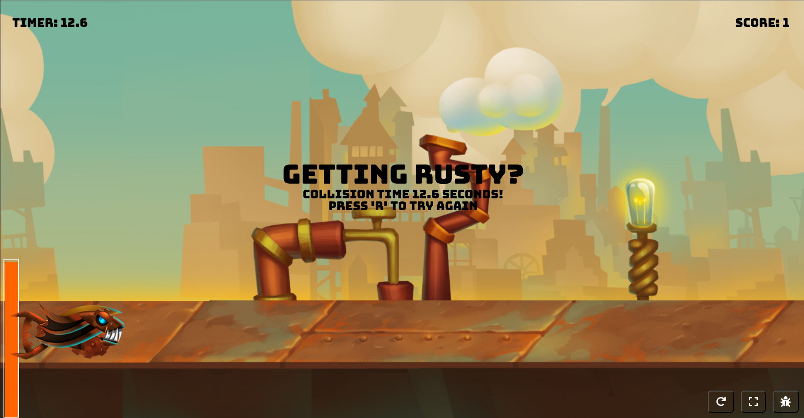
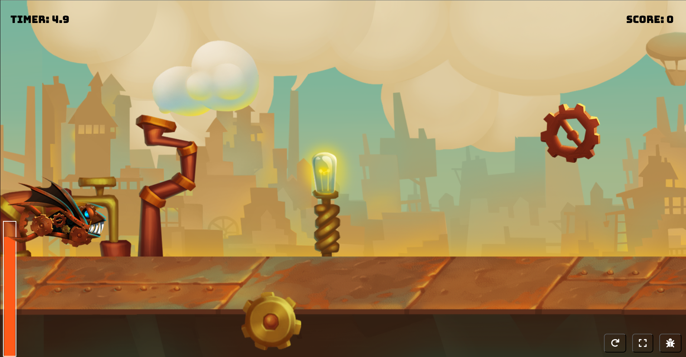

# Modern Flappy Bird

A modern take on the classic Flappy Bird game built with HTML5 Canvas and JavaScript. Features smooth animations, sound effects, and responsive controls.

## 📸 Screenshots





## 🎮 Game Features

- **Responsive Design**: Automatically scales to fit different screen sizes
- **Energy System**: Player has an energy bar that affects gameplay mechanics
- **Sound Effects**: Multiple flap sounds and audio feedback
- **Debug Mode**: Toggle collision detection visualization
- **Touch/Swipe Controls**: Mobile-friendly input handling
- **Fullscreen Support**: Immersive gameplay experience
- **Smooth Animations**: 60 FPS gameplay with fluid movement

## 🎯 How to Play

1. **Objective**: Navigate the fish through obstacles without colliding
2. **Controls**:
   - **Desktop**: Click, spacebar, or Enter to flap
   - **Mobile**: Tap the screen or swipe right to charge
3. **Energy System**: Manage your energy bar - charging affects flight mechanics
4. **Scoring**: Score points by successfully passing through obstacles
5. **Additional Controls**:
   - **Shift or C**: Start charging (desktop)
   - **R**: Resize game window
   - **F**: Toggle fullscreen
   - **D**: Toggle debug mode

## 🚀 Getting Started

### Prerequisites
- A modern web browser (Chrome, Firefox, Safari, Edge)
- No additional installations required

### Installation
1. Clone or download this repository
2. Open `index.html` in your web browser
3. Start playing!

### Running Locally
```bash
# If you have Python installed, you can run a local server:
python -m http.server 8000

# Or with Node.js:
npx serve .

# Then open http://localhost:8000 in your browser
```

## 🎮 Controls

| Action | Desktop | Mobile |
|--------|---------|--------|
| Flap | Click / Spacebar / Enter | Tap / Swipe Right |
| Restart | Restart Button | Restart Button |
| Fullscreen | Fullscreen Button | Fullscreen Button |
| Debug Mode | Debug Button | Debug Button |

## 🗂️ Project Structure

```
Modern_Flappy_Bird/
├── index.html              # Main HTML file
├── style.css              # Stylesheet
├── README.md              # This file
├── screenshots/            # Game screenshots
│   ├── img.png            # Gameplay screenshot
│   └── img2.png           # Additional screenshot
└── assets/
    ├── images/
    │   ├── background_single.png    # Game background
    │   ├── background_single2.png   # Alternative background
    │   ├── player_fish.png          # Player sprite
    │   └── smallGears.png           # UI elements
    ├── scripts/
    │   ├── main.js          # Core game logic and Game class
    │   ├── player.js        # Player character mechanics
    │   ├── obstacle.js      # Obstacle generation and collision
    │   ├── background.js    # Background rendering and scrolling
    │   └── audio.js         # Sound effects management
    └── sounds/
        ├── charge.mp3       # Charging sound effect
        ├── flap1.mp3        # Flap sound variation 1
        ├── flap2.mp3        # Flap sound variation 2
        ├── flap3.mp3        # Flap sound variation 3
        ├── flap4.mp3        # Flap sound variation 4
        ├── flap5.mp3        # Flap sound variation 5
        ├── win.mp3          # Victory sound
        └── lose.mp3         # Game over sound
```

## 🛠️ Technical Details

- **Engine**: Pure JavaScript with HTML5 Canvas
- **Rendering**: 2D Canvas API
- **Audio**: HTML5 Audio API
- **Fonts**: Google Fonts (Bungee, Londrina Outline)
- **Icons**: Font Awesome
- **Architecture**: Object-oriented with modular classes

### Key Classes
- `Game`: Main game loop and state management
- `Player`: Fish character with physics and animation
- `Background`: Scrolling background system
- `AudioControl`: Sound effects management
- `Obstacle`: Collision detection and obstacle generation

## 🎨 Customization

### Adding New Sounds
1. Add audio files to `assets/sounds/`
2. Reference them in `index.html`
3. Implement in `assets/scripts/audio.js`

### Modifying Game Physics
- Adjust gravity and speed in `main.js`
- Modify player mechanics in `player.js`
- Tweak collision detection in `obstacle.js`

### Styling Changes
- Edit `style.css` for UI modifications
- Replace image assets in `assets/images/`

## 🎯 Game Mechanics

### Energy System
- Player starts with 30 energy points
- Energy affects flight behavior
- Charging mode changes physics
- Energy regenerates over time

### Collision Detection
- Circular collision boundaries
- Debug mode shows collision areas
- Responsive to different screen sizes

### Scoring System
- Points awarded for passing obstacles
- High score tracking
- Win/lose audio feedback

## 🐛 Debug Mode

Toggle debug mode to see:
- Collision boundaries
- Game state information
- Performance metrics

## 📱 Mobile Support

- Touch controls optimized for mobile devices
- Responsive canvas scaling
- Swipe gesture recognition
- Fullscreen mode for immersive play

## 🤝 Contributing

Feel free to fork this project and submit pull requests for:
- Bug fixes
- New features
- Performance improvements
- Additional sound effects or graphics

## 📄 License

This project is open source and available under the MIT License.

## 🙏 Acknowledgments

- Inspired by the original Flappy Bird game
- Google Fonts for typography
- Font Awesome for icons
- HTML5 Canvas for rendering capabilities

---

**Enjoy the game!** 🐟✨
